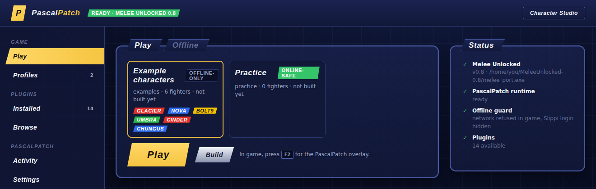
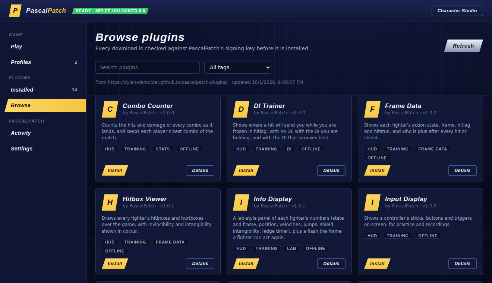
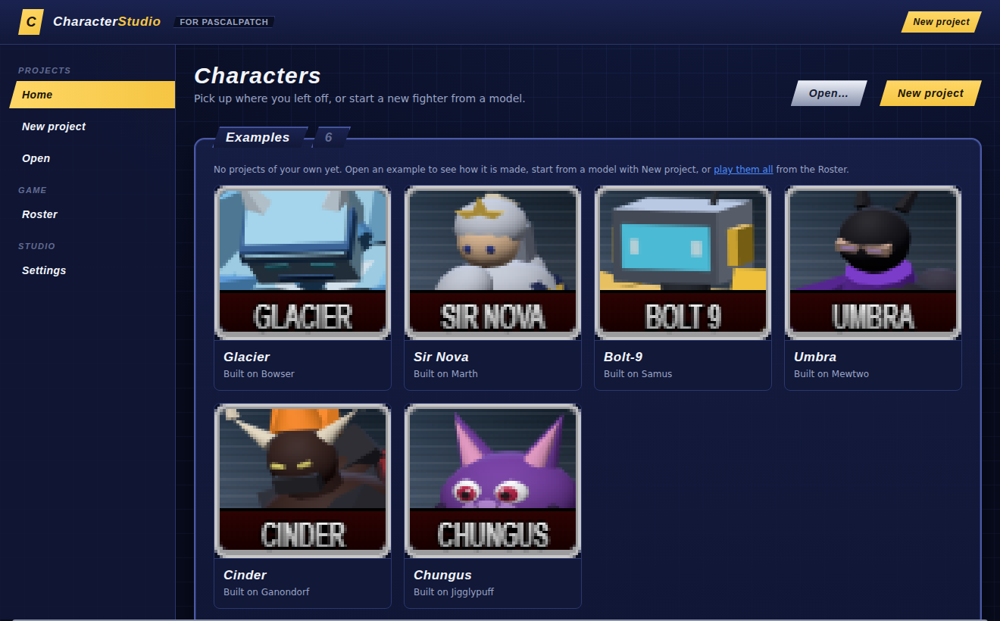

# PascalPatch

**A mod loader for Super Smash Bros. Melee on PC.** PascalPatch runs
[Melee Unlocked](https://github.com/hero88go/melee-unlocked), the native Windows version of
Melee 1.02, and loads plugins into the running game: training tools, frame data, hitboxes,
match stats, and your own custom fighters. Your game files are never modified, and everything
stays offline.



## Get started

You need a 64-bit Windows 10 or 11 PC, your own Melee NTSC 1.02 disc image (`.iso`), and
[Melee Unlocked](https://github.com/hero88go/melee-unlocked/releases) 0.7 or newer.

1. Download `PascalPatch-<version>-windows.zip` from the
   [latest release](https://github.com/Dylan-Demolder/PascalPatch/releases/latest) and unzip it.
2. Double-click **`PascalPatch.exe`**. It opens the app and puts an icon in the tray.
   Python and the runtime are included, so there's nothing else to install.
3. In **Settings**, point it at Melee Unlocked's `melee_port.exe`.
4. Under **Profiles > New profile**, pick your `.iso`.
5. On **Play**, press **Play**. In game, press **F2** for the plugin window.

[The PascalPatch guide](docs/user-guide.md) has the full walkthrough, practice recipes and
troubleshooting.

## What's in it

| | |
|---|---|
| **The app** | Profiles, Play, plugin install and settings, activity and logs. Closes to the tray. |
| **The F2 window** | In game: every running plugin, its settings and its log, plus a console. |
| **Plugins** | Installed with one click from **Browse**, or from the [plugin site](https://dylan-demolder.github.io/pascalpatch-plugins/). Every download is checked against PascalPatch's signing key. |
| **Character Studio** | Turn your own 3D models into new fighters. It comes in the download: press **Character Studio** in the app. |



## Plugins

| Plugin | What it does | Key |
|---|---|---|
| [Training Lab](plugins/training-lab/README.md) | Pause, frame advance, slow motion, percent lock, savestates, and a practice dummy that DIs, techs, counters and replays your inputs | F5 / F6 / F7, End / Delete, Home |
| [Frame Data](plugins/frame-data/README.md) | Each fighter's state, hitlag and hitstun, and who is plus after every hit or shield | |
| [Hitbox Viewer](plugins/hitbox-viewer/README.md) | Hitboxes, grab boxes and hurtboxes, with invincibility and intangibility in colour | Numpad1 |
| [DI Trainer](plugins/di-trainer/README.md) | Where a hit will send you with no DI, your DI and the best DI, while you're still in hitlag | F10 |
| [Tech Trainer](plugins/tech-trainer/README.md) | Frame-exact feedback on L-cancels, wavedashes, techs, out of shield, powershields, ledgedashes and SDI | F8 |
| [Wavedash Trainer](plugins/wavedash-trainer/README.md) | Every wavedash broken down: timing, angle, length, and the one thing to change | F12 |
| [Info Display](plugins/info-display/README.md) | A lab panel per fighter (state, velocities, jumps, shield, intangibility, ledge timer) and a flash when they can act | Insert |
| [Combo Counter](plugins/combo-counter/README.md) | Hits and damage of each combo as it lands, and everyone's best combo of the match | |
| [Match Stats](plugins/match-stats/README.md) | Slippi-style end-of-match stats (openings per kill, neutral wins, L-cancel rate), logged to a file | F4 |
| [Input Display](plugins/input-display/README.md) | A GameCube controller on screen | |
| [Quick Match](plugins/quick-match/README.md) | Boot straight into a match: no intro, title or select screens | Backspace |
| [Unlock All](plugins/unlock-all/README.md) | Every character and stage from the first boot, without touching your memory card | |

Two more run behind the scenes for Character Studio's fighters: **Extra Fighters** adds them to
the character select screen, and **Move Graft** gives a fighter another fighter's specials. All
plugin keys can be rebound in the F2 window. The full list is in
[the guide](docs/user-guide.md#every-hotkey).

## Character Studio

Bring a `.glb`, `.obj` or zipped `.gltf`, and pick the Melee fighter whose skeleton and
animations it builds on. The studio fits your model to that skeleton and lets you retune moves,
borrow specials from other fighters and change stats. Frame data and KO percents update as you
go. **Test in game** builds the fighter and drops you straight into a match with it.



Six original example fighters come with it. Code and docs are in
[MeleeCharacterStudio](https://github.com/Dylan-Demolder/MeleeCharacterStudio).

## Make your own plugin

Plugins are DLLs with a `plugin.json`. They read the game and draw HUDs through PascalPatch's
host API. [docs/plugins](docs/plugins/README.md) goes from the SDK template to your plugin in
game in about 15 minutes, then covers the full API reference and how to get it listed on the
plugin site.

## From source

```sh
git clone https://github.com/Dylan-Demolder/PascalPatch
cd PascalPatch
python tooling/native/build_plugins.py   # needs VS 2022 Build Tools + CMake; re-run after each pull
pascalpatch.cmd                          # opens the app
```

```sh
PYTHONPATH=host/src python -m unittest discover -s host/tests   # host tests
python tooling/release/package.py                               # the release zip
```

| Folder | |
|---|---|
| `host/` | The app, profile builds and the CLI (Python, standard library only) |
| `runtime/` | `pascalpatch_runtime.dll`, the launcher and the F2 overlay (C++, D3D12) |
| `sdk/` | The plugin header (`sdk/include/pascalpatch/plugin.h`) and a template plugin |
| `plugins/` | The first-party plugins |
| `tooling/` | Build, release and plugin-site scripts |
| `website/`, `design/` | The plugin site and the shared Pascal UI look |
| `docs/` | The user guide, plugin docs, and design notes |

[docs/developer.md](docs/developer.md) covers the command-line host, profile builds and the
older Dolphin tooling. [docs/architecture.md](docs/architecture.md) explains how the pieces fit.

## Offline and legal

PascalPatch blocks the game's network access and never uses Slippi or netplay. Custom fighters
would desync online, so online-safe profiles refuse them.

This repository holds no Nintendo game data. Bring your own NTSC 1.02 disc. Never commit,
share or fetch ISOs, DOLs or extracted game files.

PascalPatch is free software under the GNU General Public License, version 2 or (at your
option) any later version: see [LICENSE](LICENSE). It uses the same license as Melee Unlocked.
